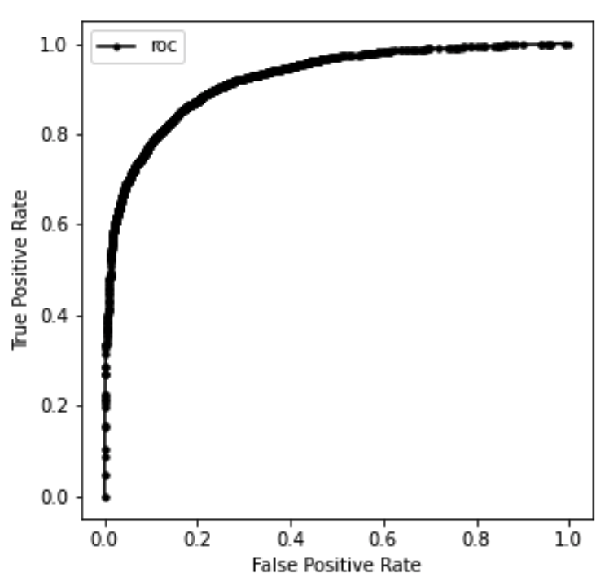
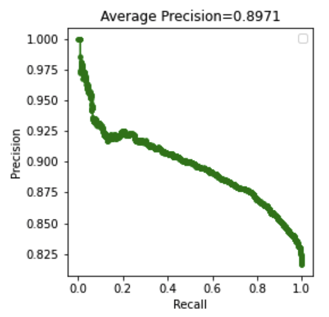
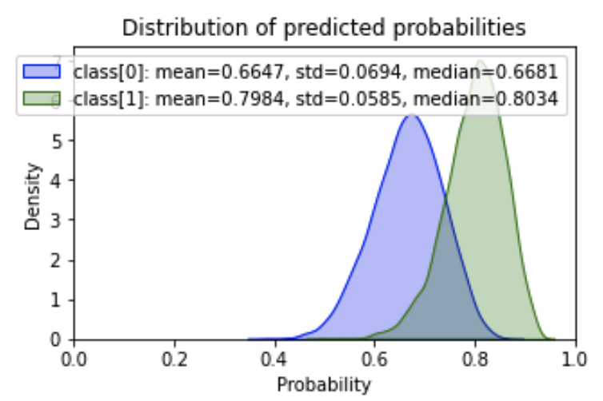
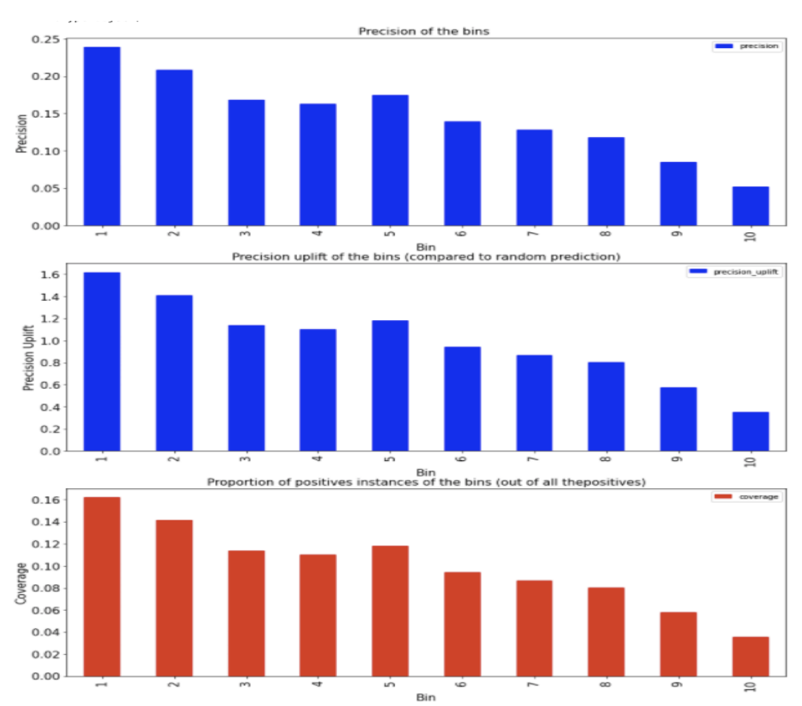
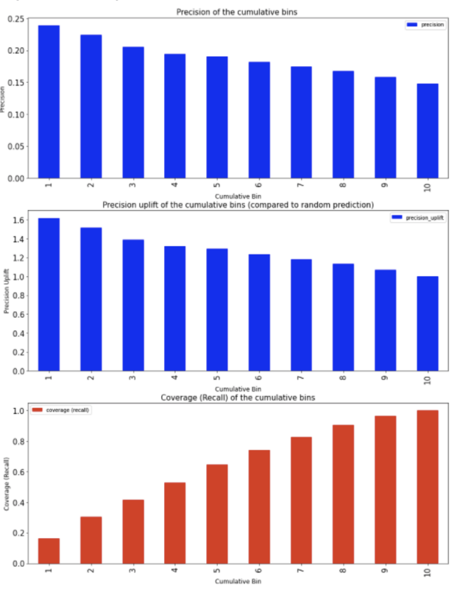
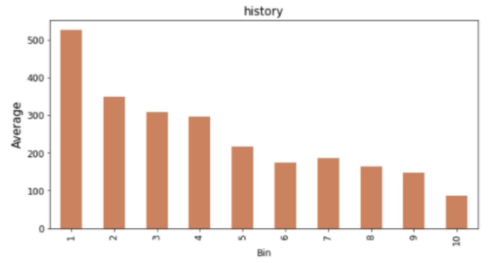
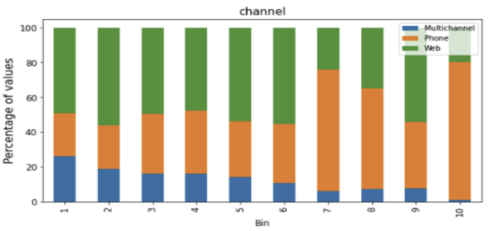
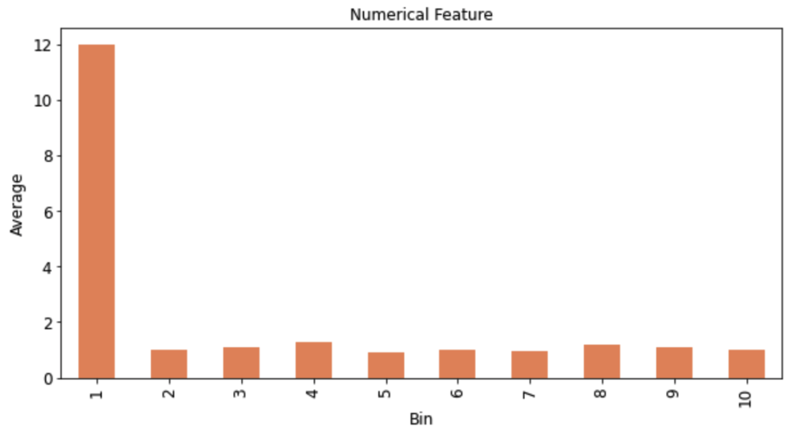

# Machine Learning Diagnostics

**Disclaimer: This is not an official Google product.**

Machine Learning Diagnostics is a library designed to provide reliability and
scalability to the data science workflow.

## Table of Contents

-   [Key Features](#key-features)
-   [Modules overview](#modules-overview)
    -   [1. Bootstrap](#1-bootstrap)
    -   [2. Binary classification diagnostics](#binary-classification-diagnostics)

## Key Features

1.  Reusable and flexible components.

## Modules overview

### Installation

```python
pip install gps_building_blocks
```

## Bootstrap
The module, `regression_bootstrap` offers a simple interface to run a
parallelized bootstrap analysis when using `sklearn.linear_model.LinearModel` models.
It is [good practice](https://statweb.stanford.edu/~owen/courses/305-1314/FoxOnBootingRegInR.pdf)
to use at least 1,000 bootstrap samples, even 10,000 is not uncommon.

### Example Usage

```python
  from sklearn import linear_model
  from google3.third_party.gps_building_blocks.py.ml.diagnostics import bootstrap

  # Regressor for the bootstrap
  elastic_net = linear_model.ElasticNet(random_state=18)
  # Regressor to be used to tune the hyper-parameters
  elastic_net_cv = linear_model.ElasticNetCV(cv=3, random_state=18)

  # Kick-off the bootstrap process using all cores but one.
  result = bootstrap.regression_bootstrap(
      data, target,
      regressor=elastic_net, regressor_cv=elastic_net_cv,
      bootstraps=5,
      n_jobs=-1)
```

## Binary classification diagnostics

This module helps to diagnose a binary classification model to make sure that
the model is reasonable (e.g. no label leakage in features). It also extracts
model insights (the relationship between features and the predictions/label)
helping to generate new business insights. Further, it produces plots to
understand the model performance in relation to the predictions helping to
design media experiments in the case of propensity models.

The different functionalities are explained below.

NOTE: Following functions require a Pandas DataFrame with columns containing the
binary label (1.0 and 0.0 values) and predicted probabilities (between 0.0 and
1.0).

#### Calculate Performance Metrics

`binary_classification.calc_performance_metrics()` calculates a series of
performance metrics related to a binary classification model.

**Usage example:**

```python
from google3.third_party.gps_building_blocks.ml.diagnostics import binary_classification

binary_classification.calc_performance_metrics(
    labels=df_pred['label'].values,
    probability_predictions=df_pred['prob'].values)
```

**Expected output:**

```python
{
    'prop_positives': 0.1475,
    'auc_roc': 0.619,
    'auc_pr': 0.2056,
    'binarize_threshold': 0.1475,
    'accuracy': 0.3209,
    'true_positive_rate': 0.9064,
    'true_negative_rate': 0.2195,
    'precision': 0.1673,
    'f1_score': 0.2825
}
```

The description of above metrics:

*   `prop_positives`: Proportion of positive instances in the dataset scored>
*   `auc_roc`: Area under the ROC curve (more on this below).
*   `auc_pr`: Area under the Precision Recall Curve (more on this below).
*   `binarize_threshold`: The probability threshold used to binarize the
     predictions to calculate the following performance metrics.
*   `accuracy`: overall accuracy of the predictions.
*   `true_positive_rate`: (Recall or Sensitivity) proportion of positive.
     instances correctly predicted out of all the positive instances in the
     dataset.
*   `true_negative_rate`: (Specificity) proportion of negative instances.
     correctly predicted out of all the negative instances in the dataset.
*   `precision`: (Confidence) proportion of positive instances correctly
     predicted out of all the instances predicted as positives.
*   `f1_score`: A weighted average between Precision and Recall.

#### Plot ROC (True Positive Rate vs False Positive Rate)

`binary_classification.plot_roc_curve()` function plots the receiver operating
characteristic (ROC) curve, which illustrates the relationship between true
positive rate and false positive rate of the predictions from a binary
classifier system. As the major metric to evaluate the ROC curve, the AUC (Area
Under The Curve) is also printed.

**Usage example:**

```python
from google3.third_party.gps_building_blocks.ml.diagnostics import binary_classification

binary_classification.plot_roc_curve(
    labels=df_pred['label'].values,
    probability_predictions=df_pred['prob'].values,
    print_stats=True,
    fig_width=5,
    fig_height=5,
    curve_color='black')
```

**Expected output:**



#### Plot Precision Recall Curve

`binary_classification.plot_precision_recall_curve()` function plots the
precision-recall curve, which illustrates the relationship between the precision
and recall of the predictions from a binary classifier system. In general a high
precision rate relates to a low false positive rate, while a high recall rate
relates to a low false negative rate. By showing the tradeoff between precision
and recall with different thresholds on the predictions, the user is able to
find out the optimal threshold for their specific problem. Moreover, the Average
Precision (AP), which calculates the area under the precision-recall curve, is
also printed for the evaluation of precision recall curve.

**Usage example:**

```python
from google3.third_party.gps_building_blocks.ml.diagnostics import binary_classification

binary_classification.plot_precision_recall_curve(
    labels=df_pred['label'].values,
    probability_predictions=df_pred['prob'].values,
    curve_color='green',
    fig_width=4,
    fig_height=4)
```

**Expected output:**



#### Plot Predicted Probability Distributions

`binary_classification.plot_predicted_probabilities()` plots the distributions
of predicted probabilities for each class. This illustrates how distinguishable
the predicted probabilities for different classes are.

**Usage example:**

```python
from google3.third_party.gps_building_blocks.ml.diagnostics import binary_classification

binary_classification.plot_predicted_probabilities(
    labels=df_pred['label'].values,
    probability_predictions=df_pred['prob'].values,
    plot_cumulative=False)
```

**Expected output:**




#### Calculate and plot performance metrics for Bins of the Probabilities

`binary_classification.calc_bin_metrics()`calculates performance metrics for
bins of the predicted probabilities. It does following:

1.  Sort predicted probabilities in the descending order, then divides the
    instances into N number of equal sized bins (e.g. deciles when N = 10) such
    that the first bin has the instances with the highest probabilities and so
    on.
2.  Calculate the Precision, Precision Uplift (Precision of the bin divided by
    the proportion of positive instances in the dataset indicating the Precision
    of selecting a random sample of the size of the bin) and Coverage (or
    Recall = the proportion of positive instances in the bin out of all the
    positive instances in the dataset) for each bin.

**Usage example:**

```python
from google3.third_party.gps_building_blocks.ml.diagnostics import binary_classification

bin_metrics = binary_classification.calc_bin_metrics(
    labels=df_pred['label'].values,
    probability_predictions=df_pred['prob'].values)

binary_classification.plot_bin_metrics(bin_metrics=bin_metrics)
```

**Expected output:**



**Observations:** These plots can give a good understanding of the model
performance for these different bins of the probability predictions. Generally
we would expect to see a monotonically decreasing trend of these metrics going
from the top bin to the bottom bin. If we see some different pattern from this
plot, it would create some doubts of the quality of the model leading to further
investigations.

#### Calculate and plot performance metrics for Cumulative Bins of the Probabilities

`binary_classification.calc_cumulative_bin_metrics()` calculates performance
metrics for cumulative bins of the predicted probabilities. It does following:

1.  Sort predicted probabilities in the descending order, and then divides the
    instances into N number of bins with increasing size. For example, when N =
    10, it creates 10 bins such that the first bin contains the top 10%
    instances with the highest probability, the second bin contains the top 20%
    instances with the highest probability and so on where the last bin contains
    all the instances.
2.  Calculates the Precision, Precision Uplift (Precision of the bin divided by
    the proportion of positive instances in the dataset indicating the Precision
    of selecting a random sample of the size of the bin) and Coverage (or
    Recall = the proportion of positive instances in the bin out of all the
    positive instances in the dataset) for each bin.

**Usage example:**

```python
from google3.third_party.gps_building_blocks.ml.diagnostics import binary_classification

cumulative_bin_metrics = binary_classification.calc_cumulative_bin_metrics(
    labels=df_pred['label'].values,
    probability_predictions=df_pred['prob'].values)

binary_classification.plot_cumulative_bin_metrics(
    cumulative_bin_metrics=cumulative_bin_metrics)
```

**Expected output:**



**Observations:** From these plots we would generally expect the Precision and
Precision uplift to monotonically decrease and Recall to monotonically increase
when we go from the high probability bins to the lower ones. These plots give us
a good understanding of the expected precision and recall values for example if
we select top N% of the instances.

#### Feature Exploration Plots

`binary_classification.plot_binned_features()` calculates and plots the
distribution of features in the dataset for the equal sized bins of the
predicted probability. That is, it first sorts predicted probabilities in the
descending order, and then divides the instances into N number of equal sized
bins (e.g. deciles when N = 10) such that the first bin has the instances with
the highest probabilities and so on. Then it calculates and plots the
distribution of each feature for each plot.

NOTE: Following functions require a Pandas DataFrame with columns containing the
predicted probabilities (between 0.0 and 1.0) and features.

```python
from google3.third_party.gps_building_blocks.ml.diagnostics import binary_classification

feature_names = ('recency', 'history', 'channel', 'zip_code')
feature_types = ('numerical', 'numerical', 'categorical', 'categorical')
binary_classification.plot_binned_features(
    data=df_pred,
    prediction_column_name='prob',
    feature_names=feature_names,
    feature_types=feature_types)
```

**Expected outputs:**

The output plots can be used to understand the relationships (positive, negative
and non-linear correlations) between the features and the predictions (labels)
leading to:

*   extract new insights in relation to the business problem (e.g. how the
    demographics, user-behaviour or functionalities in the app/website related
    to the conversion rate).
*   confirm the relationships the model has learned between features and label
    makes sense (e.g. it hasn't learned any suspicious relationships caused by
    label leakages due to data collection or processing issues).

*Numerical Feature Plots:* For each numerical feature, the average value is
plotted for each bin as shown below. For example, in the following plot we see
the positive correlation between the features ‘history’ and the predictions.



*Categorical feature plots:* For each categorical feature we plot the
distribution of categorical values within each bin to observe their relationship
between the predictions as shown below.



*Example of a suspicious feature:* If a feature shows a very dramatic
distribution change going from high probability bins to low probability ones (as
in the plot below) that would require more investigation to make sure that
distribution change is not due to data collection or processing issues.


