# TCRM Install Guide

_Copyright 2021 Google LLC. This solution, including any related sample code or
data, is made available on an “as is,” “as available,” and “with all faults”
basis, solely for illustrative purposes, and without warranty or representation
of any kind. This solution is experimental, unsupported and provided solely for
your convenience. Your use of it is subject to your agreements with Google, as
applicable, and may constitute a beta feature as defined under those agreements.
To the extent that you make any data available to Google in connection with your
use of the solution, you represent and warrant that you have all necessary and
appropriate rights, consents and permissions to permit Google to use and process
that data. By using any portion of this solution, you acknowledge, assume and
accept all risks, known and unknown, associated with its usage, including with
respect to your deployment of any portion of this solution in your systems, or
usage in connection with your business, if at all._

- [TCRM Install Guide]
  * [Step 1. Setup Google Cloud Platform (GCP)](#step-1-setup-google-cloud-platform-gcp)
  * [1.1 Select or Create a GCP Project](#11-select-or-create-a-gcp-project)
  * [Step 2: Install TCRM](#step-2-install-tcrm)
    + [2.1 Install TCRM](#22-install-tcrm)
  * [Step 3: Configure Airflow and Set Up Variables](#step-3-configure-airflow-and-set-up-variables)
    + [3.1 Setup BigQuery Connection](#31-setup-bigquery-connection)
    + [3.2 Setup variables using Airflow UI](#32-setup-variables-using-airflow-ui)
    + [3.3 Configure General DAG variables](#33-configure-general-dag-variables)
      - [3.3.1 General Variable Table](#331-general-variable-table)
      - [3.3.2 Schedule a DAG](#332-schedule-a-dag)
    + [3.4 Configure specific DAG variables](#34-configure-specific-dag-variables)
      - [3.4.1 tcrm_bq_to_ga DAG](#341-tcrm-bq-to-ga-dag)
      - [3.4.2 tcrm_gcs_to_ga DAG](#342-tcrm-gcs-to-ga-dag)
      - [3.4.3 tcrm_bq_to_ads_oc DAG](#343-tcrm-bq-to-ads-oc-dag)
      - [3.4.4 tcrm_gcs_to_ads_oc DAG](#344-tcrm-gcs-to-ads-oc-dag)
    + [3.5 Authentication against Google Platforms](#35-authentication-against-google-platforms)
      - [3.5.1 Create ads_credentials YAML string for Google Ads Authentication](#351-create-ads-credentials-yaml-string-for-google-ads-authentication)
  * [Step 4: Prepare Data to Send](#step-4-prepare-data-to-send)
    + [4.1 Prepare Data for Google Analytics (GA)](#41-prepare-data-for-google-analytics-ga)
    + [4.2 Prepare Data for Google Ads Offline Conversion](#42-prepare-data-for-google-ads-offline-conversion)
  * [Step 5: Run TCRM](#step-5-run-tcrm)

### Step 1: Setup Google Cloud Platform (GCP)

#### 1.1 Select or Create a GCP Project

Create a new
[Google Cloud Platform project](https://console.cloud.google.com),
or use an existing one. Open it and make sure you can see the project name at
the top of the page.
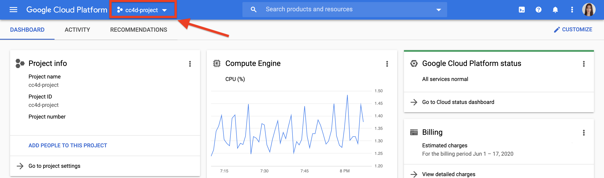

### Step 2: Install TCRM

#### 2.1 Install TCRM

1.  Click on the Cloud Shell Icon on the top right corner of the page to open
    the GCP command line.
    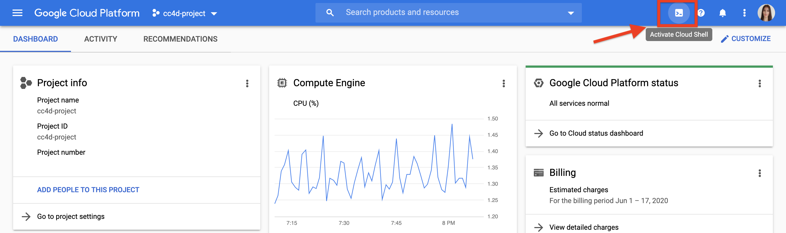

2.  Run the following command in the shell to clone the TCRM code folder:

```bash
  git clone https://github.com/google/tcrm.git
```

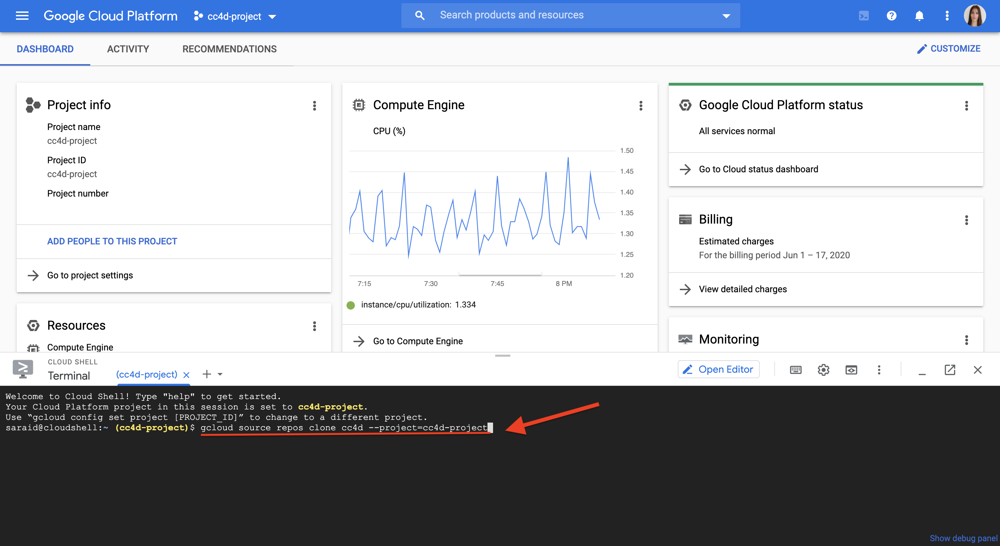
3. Next, run this command:

```bash
cd tcrm && sh setup.sh --project_id=$GOOGLE_CLOUD_PROJECT
```

   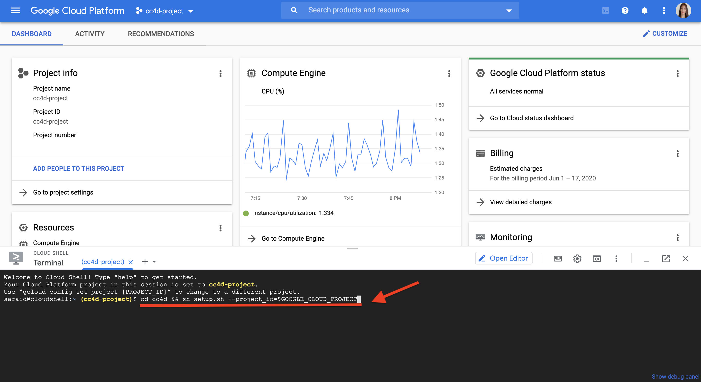

NOTE: This command will do the following 3 steps: 1. Create a Python virtual
environment, and install all the required Python packages. 2. Enable the
required Cloud APIs in the GCP project. 3. Create a Cloud Composer environment,
and deploy the TCRM DAGs into it.

NOTE: The installation should take about 2 hours. Please wait until the
script finishes running.

### Step 3: Configure Airflow and Set Up Variables

#### 3.1 Setup BigQuery Connection

To read data from BigQuery, you must link your service account to the BigQuery
connection.

Click on Identity → Service Accounts. Then click on the three dots next to the
service account that starts with `tcrm-sa` and select Create Key → JSON →
Create.

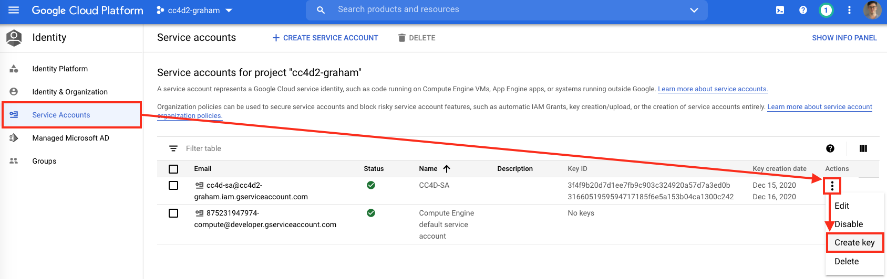

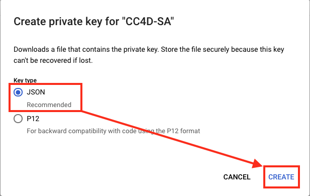

Open the downloaded key in a text editor and copy the JSON within.

Go back to Airflow (Composer → Airflow) and select Admin → Connections.


Click on the pencil icon next to the connection `bigquery_default`.

NOTE: The default connection name is `bigquery_default`. If you are using a
different BigQuery connection name please make sure to set the
`monitoring_bq_conn_id` and `bq_conn_id` Airflow **variables** (variables, not
connections) with the new connection name.

TIP: Refer to
[this page](https://cloud.google.com/composer/docs/how-to/managing/connections)
for more details on managing Airflow connections.

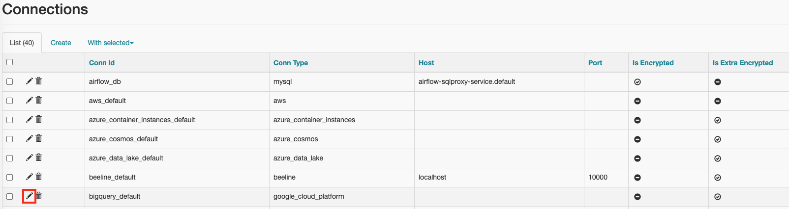

Paste the service account JSON into the Keyfile JSON field and click save.

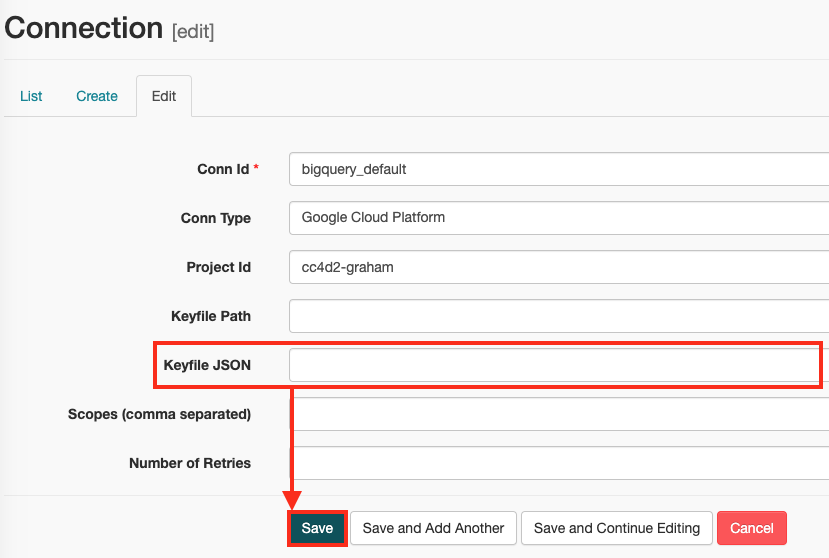

#### 3.2 Setup variables using Airflow UI

1.  Open the menu on the top left part of the screen. Then click on `Composer`to
    open the
    [Composer environments page](http://console.cloud.google.com/composer).
    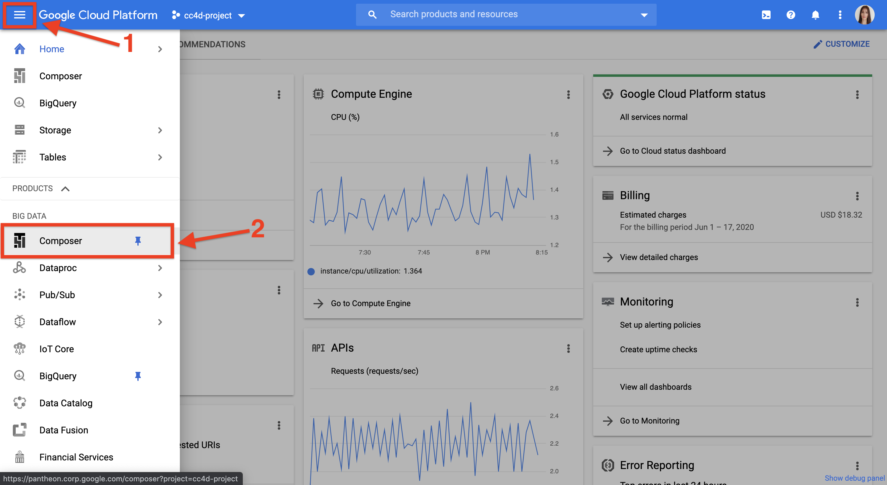

2.  In the Composer Screen, find the row named `tcrm-env` on the left side of
    the list. In that row, click the `Airflow` link to open the Airflow console.
    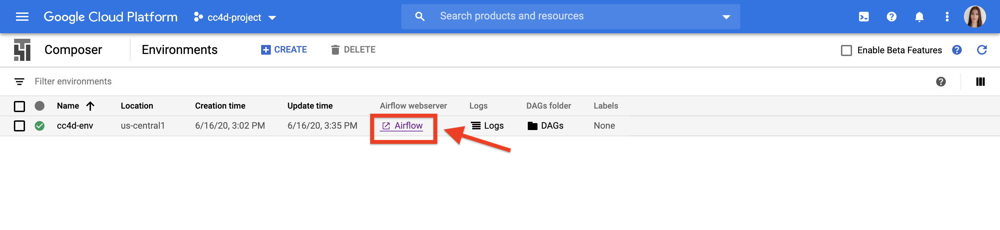

3.  In the Airflow console, on the top menu bar, click on `Admin` option, then
    choose `Variables` from the drop down menu.
    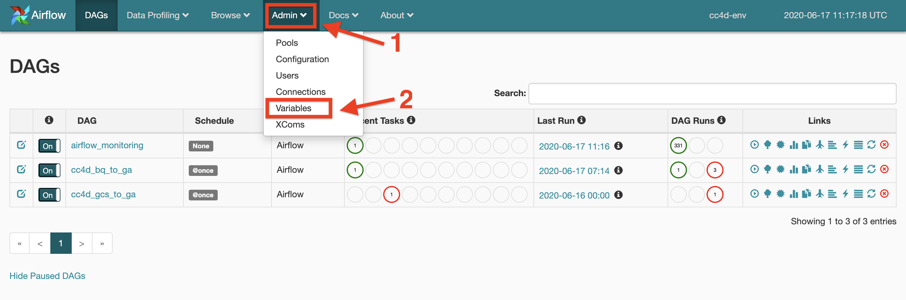

4.  In the Variables screen click on `Create`.
    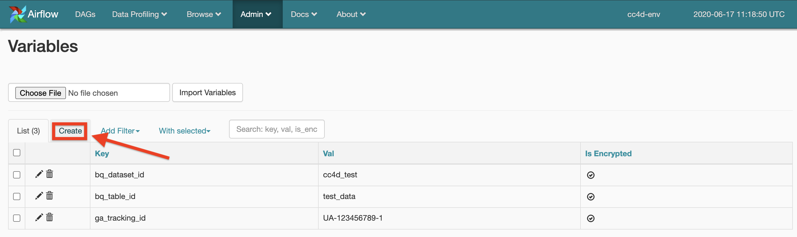

5.  To add a new variable enter the variable key name and the value, then click
    on `save`. Refer to the next 2 steps to see which variables are needed for
    each DAG.
    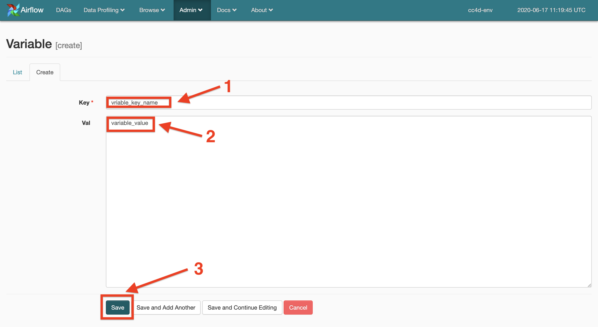

#### 3.3 Configure General DAG variables

The following table contains the general variables needed by all the DAGs.
Those variables have default values already automatically set up for you so
**you don't need to change anything if the default values fit your needs**. You
can change these variables, however, at any time by setting an Airflow variable
with the same `Variable Name` to another value.

To allow for different DAGs to have different configurations some varriables'
names will contain the DAG name as a prefix. Pleease be sure you replace the
`<DAG Name>` part and use the right DAG name.

For example: to set the schedule variable for `tcrm_gcs_to_ga` DAG, take the
variable name from the below table `<DAG Name>_schedule` and create a variable
called `tcrm_gcs_to_ga_schedule`. To schedule `tcrm_gcs_to_ads_oc` DAG, create a
variable called `tcrm_gcs_to_ads_oc_schedule`.

The DAG name can be found in the Airflow UI in the DAGs tab:
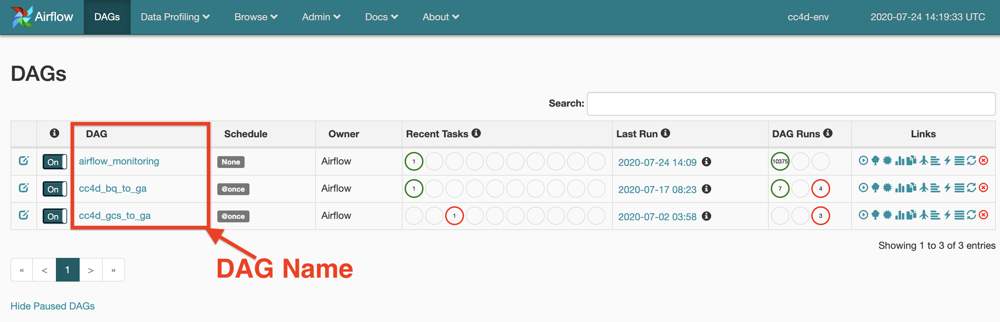

##### 3.3.1 General Variable Table

Variable Name                  | Default Value             | Variable Information
------------------------------ | ------------------------- | --------------------
`<DAG_Name>_retries`           | `0`                       | Integer. Number of times Airflow will try to re-run the DAG if it fails. We recommend to keep this at 0 since TCRM has its own retry mechnism. Seting it to any other integer however will not cause errors, but it will not attempt to re-send previously faild events.
`<DAG_Name>_retry_delay`       | `3`                       | Integer. Number of minutes between each DAG re-run.
`<DAG_Name>_schedule`          | `@once`                   | A DAG Schedule. See section [3.3.2 Schedule a DAG](#332-schedule-a-dag) for more information on how to schedule DAGs.
`<DAG_Name>_is_retry`          | `1`                       | `1` to enable, `0` to disable. Whether or not the DAG should retry sending previously failed events to the same output source. This is an internal retry to send failed events from previous similar runs. It is different from the Airflow retry of the whole DAG. See the [Retry Mechanism](#) section of this Usage Guide for more information.
`<DAG_Name>_is_run`            | `1`                       | `1` to enable, `0` to disable. Whether or not the DAG should include a main run. This option can be disabled should the user want to skip the main run and only run the retry operation. See the [Run](#) section of this Usage Guide for more information.
`<DAG_Name>_enable_run_report` | `0`                       | `1` to enable, `0` to disable. Indicates whether the DAG will return a run report or not. Not all DAGs have reports. See the [Reports](#) section of this Usage Guide for more information.
`<DAG_Name>_enable_monitoring` | `1`                       | `1` to enable, `0` to disable. See the [Monitoring](#) section of this Usage Guide for more information.
`monitoring_dataset`           | `tcrm_monitoring_dataset` | The dataset id of the monitoring table.
`monitoring_table`             | `tcrm_monitoring_table`   | The table name of the monitoring table.
`monitoring_bq_conn_id`        | `bigquery_default`        | BigQuery connection ID for the monitoring table. This could be the same or different from the input BQ connection ID.

##### 3.3.2 Schedule a DAG

To setup the DAG scheduler, create a schedule variable for each DAG you want to
schedule. The variable name should start with the DAG name, followed by
`_schedule`.

The value of the variable should be the interval you wish to schedule your DAG
to. For example:

Insert @once to run the DAG only once, or insert `@daily` or `@weekly` to set
the DAG to run accordingly. Refer to this
[guide](https://airflow.apache.org/docs/stable/dag-run.html) to
find out about all the available scheduling options.

These are optional variables. If schedule variables are not set, the default
schedule for all DAGs is `@once`.

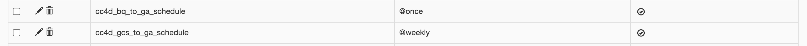

#### 3.4 Configure specific DAG variables

The following section indicates which variables are needed to run each DAG. You
will only need to set up variables for the DAGs you are planning to use.

##### 3.4.1 `tcrm_bq_to_ga` DAG

To to run the `tcrm_bq_to_ga` DAG set the following variables:

*   `bq_dataset_id`: The name of the BigQuery dataset containing the data.
    Example: `my_dataset`
*   `bq_table_id`: The name of the BigQuery table containing the data. Example:
    `my_table`
*   `ga_tracking_id`: Google Analytics Tracking ID. Example: `UA-123456789-1`

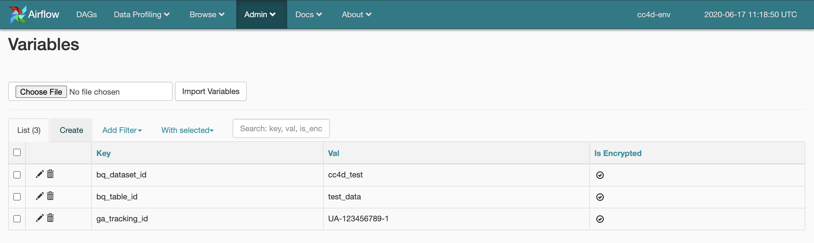

##### 3.4.2 `tcrm_gcs_to_ga` DAG

To run the `tcrm_gcs_to_ga` DAG set the following variables:

*   `gcs_bucket_name`: Cloud Storage bucket name. Example: `my_bucket`
*   `gcs_bucket_prefix`: The path to the data folder inside the bucket. Example:
    `folder/sub_folder`
*   `gcs_content_type`(optional): Cloud Storage content type. Either `JSON` or
    `CSV`.
*   `ga_tracking_id`: Google Analytics Tracking ID. Example: `UA-123456789-1`

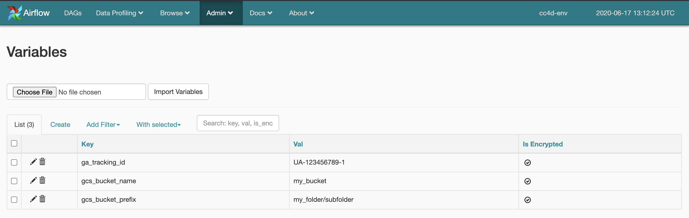

##### 3.4.3 `tcrm_bq_to_ads_oc` DAG

To run the `tcrm_bq_to_ads_oc` DAG set the following variables:

*   `bq_dataset_id`: The name of the BigQuery dataset containing the data.
    Example: `my_dataset`
*   `bq_table_id`: The name of the BigQuery table containing the data. Example:
    `my_table`
*   `ads_credentials`: The authentication info for Google Adwords API, please
    refer to
    [3.5.1 Create ads_credentials YAML string for Google Ads Authentication](#351-create-ads-credentials-yaml-string-for-google-ads-authentication)
    for more information.

##### 3.4.4 `tcrm_gcs_to_ads_oc` DAG

To run the `tcrm_gcs_to_ads_oc` DAG set the following variables:

*   `gcs_bucket_name`: Cloud Storage bucket name. Example: `my_bucket`
*   `gcs_bucket_prefix`: The path to the data folder inside the bucket. Example:
    `folder/sub_folder`
*   `gcs_content_type`(optional): Cloud Storage content type. Either `JSON` or
    `CSV`.
*   `ads_credentials`: The authentication info for Google Adwords API, please
    refer to
    [3.5.1 Create ads_credentials YAML string for Google Ads Authentication](#351-create-ads-credentials-yaml-string-for-google-ads-authentication)
    for more information.

#### 3.5 Authentication for Google Platforms

##### 3.5.1 Create ads_credentials YAML string for Google Ads Authentication

To authenticate yourself for Google Ads you will need to create a YAML
formatted string and save it as an Airflow parameter. This parameter will be
used by TCRM to authenticate with Google Ads. The string contains
5 fields as follows:

```
adwords:
        client_customer_id: 123-456-7890
        developer_token: abcd
        client_id: test.apps.googleusercontent.com
        client_secret: secret
        refresh_token: 1//token
```

client_customer_id is located on the top right above your email after you log in
to Google Ads. The Google Ads account should contain the campaign for TCRM to
automate.

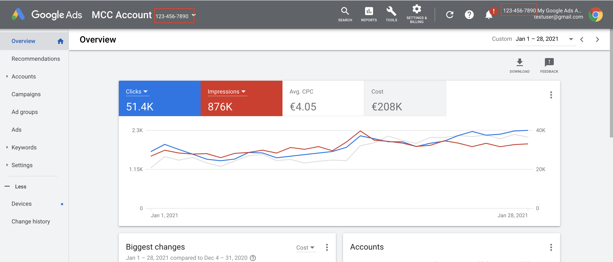

developer_token is located in API Center after you log in to your Google Ads MCC
account. The Google Ads MCC account should include the above Google Ads account
that contains the campaign for TCRM to automate.

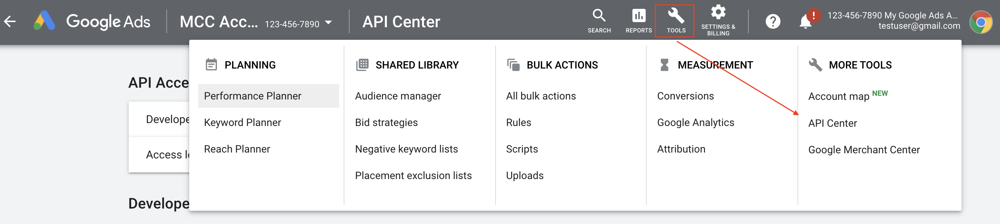


client_id and client_secret can be created in the APIs & Services page in GCP
console.

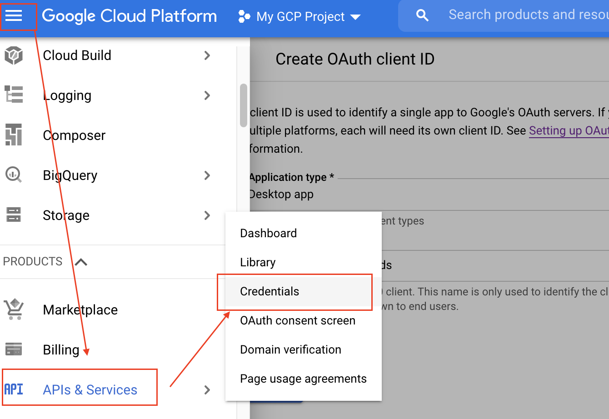

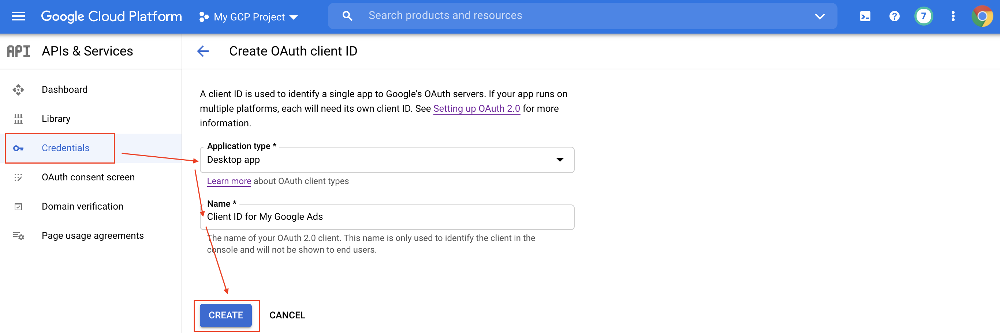

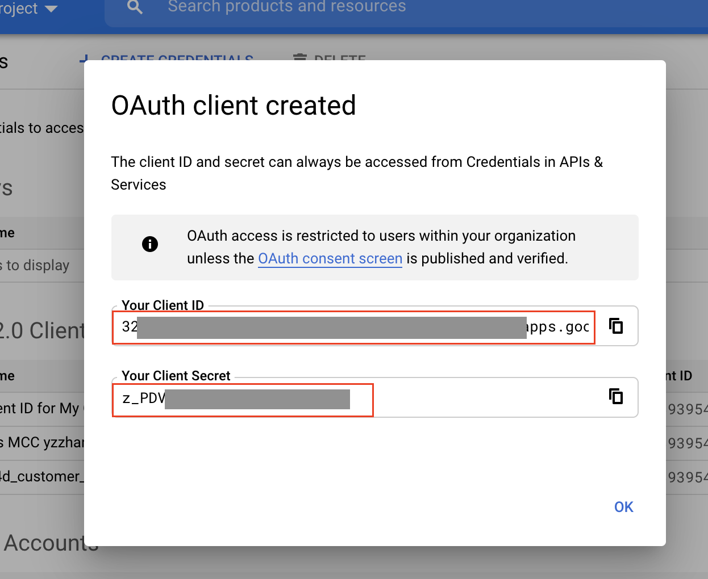

refresh_token can be generated by doing the following:

*   [Download Python script](https://github.com/googleads/googleads-python-lib/blob/master/examples/adwords/authentication/generate_refresh_token.py).

*   Execute the Python script with the required parameters in a terminal.
    `python generate_refresh_token.py --client_id INSERT_CLIENT_ID
    --client_secret INSERT_CLIENT_SECRET`

*   Click on the link.

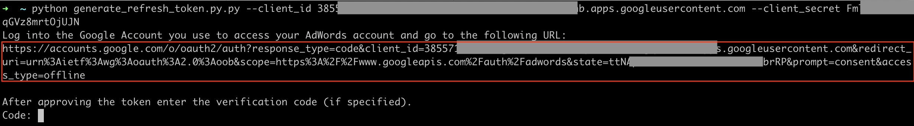

*   Choose the email account that has the permission to modify your Google Ads
    data and click Allow.

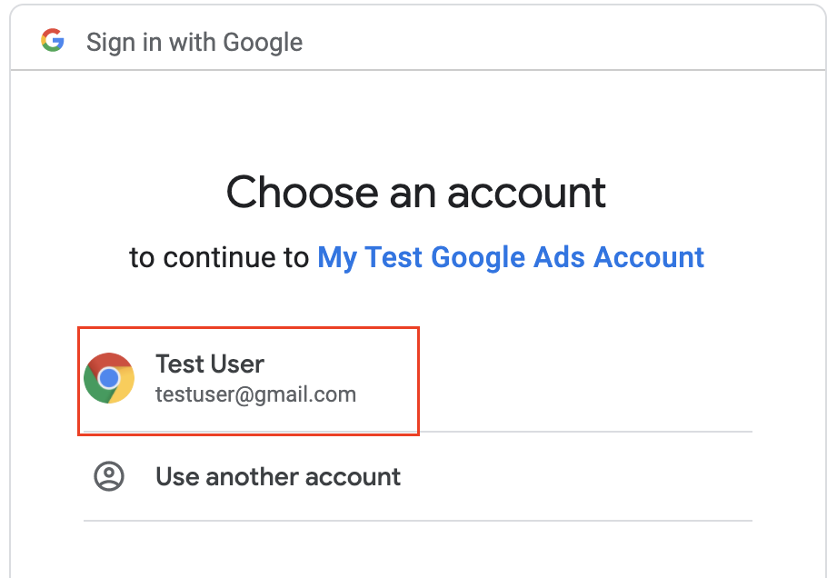

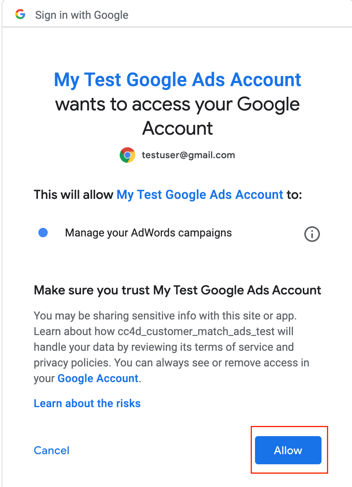

*   Copy the code and paste it into the terminal after the code. The refresh
    token will be shown below.

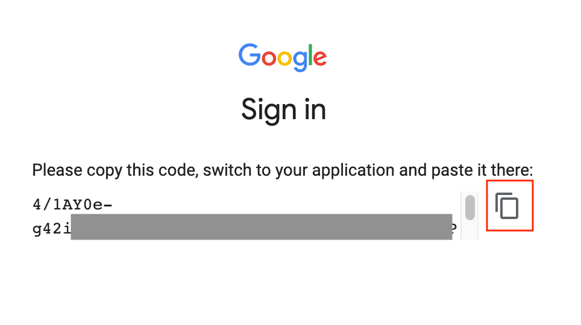

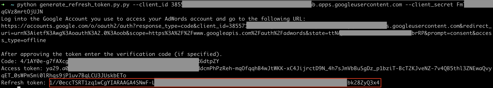

### Step 4: Prepare Data to Send

#### 4.1 Prepare Data for Google Analytics (GA)

NOTE: Refer to the
[Measurement Protocol API](https://developers.google.com/analytics/devguides/collection/protocol/v1/devguide)
for the detailed requirements.

To send your data to GA you can choose from the following 3 options:

1.  From BigQuery using the `tcrm_bq_to_ga` DAG in SQL table Format.
    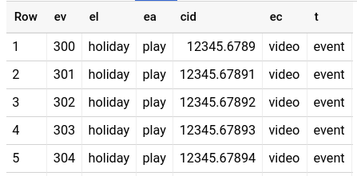

2.  From Google Cloud Storage using the `tcrm_gcp_to_ga` DAG in JSON Format.

```json
{"cid": "12345.67890", "t":"event", "ec": "video", "ea": "play", "el": "holiday", "ev": "300" }
{"cid": "12345.67891", "t":"event", "ec": "video", "ea": "play", "el": "holiday", "ev": "301" }
{"cid": "12345.67892", "t":"event", "ec": "video", "ea": "play", "el": "holiday", "ev": "302" }
{"cid": "12345.67893", "t":"event", "ec": "video", "ea": "play", "el": "holiday", "ev": "303" }
```

1.  From Google Cloud Storage using the `tcrm_gcp_to_ga` DAG in CSV Format.

```json
cid,t,ec,ea,el,ev
12345.67890,event,video,play,holiday,300
12345.67891,event,video,play,holiday,301
12345.67892,event,video,play,holiday,302
12345.67893,event,video,play,holiday,303
```

WARNING: To make sure GA will accept the data sent from TCRM you need to
configure GA's bot filtering. To do this, go to `Admin -> View Settings -> Bot
Filtering` in your
[Google Analytics UI](https://analytics.google.com/analytics)
and **uncheck** “Exclude all hits from known bots and spiders”.

#### 4.2 Prepare Data for Google Ads Offline Conversion

To send your data to Google Ads you can choose from the following 3 options:

1.  From BigQuery using the `tcrm_bq_to_ads_oc` DAG in SQL table Format.
    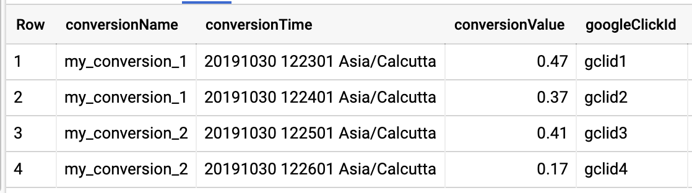

2.  From Google Cloud Storage using the `tcrm_gcs_to_ads_oc` DAG in JSON Format.

```json
{"conversionName": "my_conversion_1", "conversionTime":"20191030 122301 Asia/Calcutta", "conversionValue": "0.47", "googleClickId": "gclid1"}
{"conversionName": "my_conversion_1", "conversionTime":"20191030 122401 Asia/Calcutta", "conversionValue": "0.37", "googleClickId": "gclid2"}
{"conversionName": "my_conversion_2", "conversionTime":"20191030 122501 Asia/Calcutta", "conversionValue": "0.41", "googleClickId": "gclid3"}
{"conversionName": "my_conversion_2", "conversionTime":"20191030 122601 Asia/Calcutta", "conversionValue": "0.17", "googleClickId": "gclid4"}
```

1.  From Google Cloud Storage using the `tcrm_gcp_to_ads_oc` DAG in CSV Format.

```json
conversionName,conversionTime,conversionValue,googleClickId
my_conversion_1,20191030 122301 Asia/Calcutta,0.47,gclid1
my_conversion_1,20191030 122401 Asia/Calcutta,0.37,gclid2
my_conversion_2,20191030 122501 Asia/Calcutta,0.41,gclid3
my_conversion_2,20191030 122601 Asia/Calcutta,0.17,gclid4
```

### Step 5: Run TCRM

In the Airflow console click on the `DAGs` option from the top menu bar. Find
the DAG you’d like to run in the list on the left. Then run it by clicking the
`Play` button on the right side of the list.
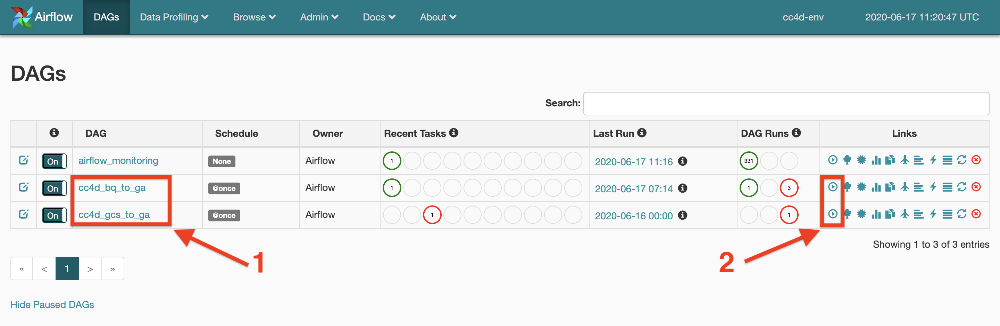
